##AutoTCG使用手册
###概述
自动化测试通过机器执行事先准备好的测试脚本进行，提升了软件测试效率。然而，测试脚本存在着编写专业性强、调试工作量大、维护成本高、难以复用等困难，成为自动化测试技术的难以广泛使用的主要技术瓶颈。
AutoTCG使用了模型驱动的测试脚本生成方法。首先，使用遵循BPMN2.0规范的方法对被测系统业务流程进行可视化建模，获得模型化的测试需求；然后，采用路径深度覆盖算法生成测试路径，根据路径上的约束条件生成测试输入参数；最后，通过自定义的测试动作原语将测试路径和输入参数转化为可在自动化测试平台上自动执行的测试脚本。
AutoTCG采用先进的数学算法，可实现全面科学的测试覆盖；适用于嵌入式软件测试、web应用测试、移动app测试、桌面软件测试等多种自动化测试场景。
###文件夹显示和操作
打开AutoTCG网址，进入“我的文件夹”，可以查看我的模型文件夹内容。
“我的文件夹”中有四个主文件夹：我的文件、最近修改、我的收藏、回收站。
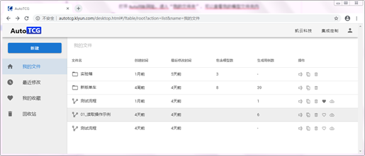  

####我的文件
以列表形式显示显示我创建的文件，包含子文件夹和模型文件。列表内容包括了文件名、创建时间、最后修改时间、包含模型数（对子文件夹有效）、生成用例数、操作。
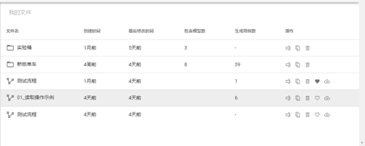  

子文件夹的操作有：重命名、移动/复制、移到回收站。
模型文件的操作有：重命名、移动/复制、移到回收站、收藏、发布到公共模型库。
点击子文件夹名称可以进入子文件夹。显示方式同“我的文件”。
点击模型文件名称，可以进入模型文件编辑界面。
子文件夹界面上方显示路径。点击路径上的任意名称可以进入该文件夹。
####最近修改
以列表形式显示最近修改的模型文件，按照修改时间进行排序，最近修改的模型排在最前面。列表内容包括了文件名、创建时间、最后修改时间、生成用例数、操作。
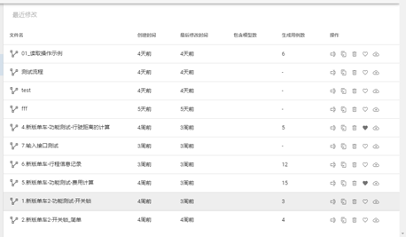 

模型文件的操作有：重命名、移动/复制、移到回收站、收藏、发布到公共模型库。
最近修改文件夹只显示最近修改的10个模型。
####我的收藏
以列表形式显示显示我收藏的模型文件。列表内容包括了文件名、创建时间、最后修改时间、生成用例数、操作。
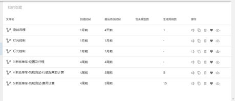 

模型文件的操作有：重命名、移动/复制、移到回收站、收藏、发布到公共模型库。“收藏”图标显示为“已收藏”的状态。
####回收站
以列表形式显示被移动到回收站的模型文件。列表内容包括了文件名、创建时间、最后修改时间、生成用例数、操作。
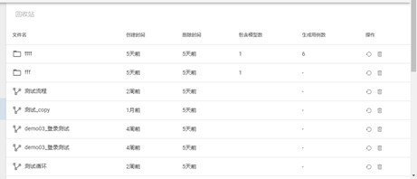 

模型文件的操作有：恢复、彻底删除。回收站中的模型文件点击名称不能进入编辑界面。
###新建
新建功能包括三个功能：新建文件夹、新建模型文件、从模型库新建。
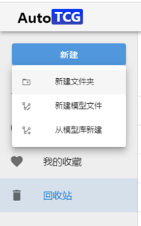 

点击“新建文件夹”弹出“新建文件夹”对话框，并且有“确定”和“取消”两个按钮。输入文件夹名称后点击“确定”，会在“我的文件”下的当前文件夹下新建文件夹。
点击“新建模型文件”弹出“新建模型文件”对话框，并且有“确定”和“取消”两个按钮。输入模型文件名称后点击“确定”，会在“我的文件”下的当前文件夹下新建模型文件，并且默认打开模型文件进行编辑。
点击“从模型库新建”打开“从模板库新建”界面，显示模板库内容。点击任意模板模型名称后，会在“我的文件”下的当前文件夹下新建模型文件，并且默认打开模型文件进行编辑，模型的内容为模板模型的内容。
###模型的编辑
模型编辑界面上方是模型显示区域，下方是模型设置区域。左侧显示模型编辑工具栏。顶部显示模型名称和回到文件夹界面的按钮。
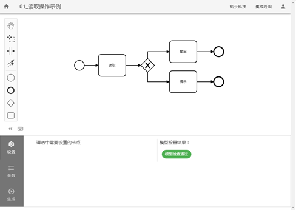 

在模型显示区域点击任何元素之外的位置，拖动鼠标，可以整体移动模型。点击任意元素，可以选中该元素。
####工具栏
工具栏分为两部分。第一部分包括4个工具按钮：抓取工具、区域选择、间隙工具、连线工具。

1、	抓取工具：
点击抓取工具后，鼠标会变成抓取工具的形状。在模型显示区域的任意位置，按下鼠标键并拖动，可以移动整个模型。鼠标单击模型外的任意位置，抓取工具失效，鼠标变回箭头的形状。

2、	区域选择：
点击区域选择工具后，鼠标会变成区域选择工具的形状。在模型显示区域按下鼠标键并拖动，会产生一个矩形，矩形内的元素（任务、开始、结束、网关、连线）会被选中。用鼠标拖动选中部分的元素，选中部分会整体跟随鼠标移动，其余部分保持不动。。鼠标点击被选中区域以外的任何地方，选中状态消失，恢复到区域选择之前的状态。

3、	间隙工具：
点击间隙工具后，鼠标会变成间隙工具的形状。在模型显示区域按下鼠标键并上下/左右滑动，会产生一条横向/纵向分割线（上/下划动产生横向分割线，左/右划动产生纵向分割线，），并且分割线下方/右方的所有元素会向鼠标移动方向同步整体移动（上/下划动，分割线下方的元素跟随移动；左/右划动，分割线右方的元素跟随移动），而其余元素的位置保持不变。移动完成后，鼠标保持间隙工具的形状，并且可以再次进行上述操作。鼠标点击任意位置，鼠标会回复到箭头形状，间隙工具失效。

4、	连线工具：
点击连线工具后，鼠标会进入连线工具状态。把鼠标移到图标元素（开始、结束、网关、任务）上方，该元素会进入一种特殊的选中状态，在该元素上点击鼠标，即可完成起始元素的选择；然后，按照上面的方式，继续选择结束元素。选择完成后，将添加一条从起始元素到结束元素的连线。而后鼠标恢复初始状态，连线工具失效。连线操作期间，鼠标放在任意图标元素之外的地方，鼠标变为“不可用”状态。

第二部分包括4个元素按钮：开始、结束、网关、任务。
1、	开始：
点击该图标，鼠标将变成开始图标的形状；然后在模型编辑区域任意位置点击，可以将开始元素添加到模型中该位置，鼠标形状恢复。

2、	结束：
点击该图标，鼠标将变成结束图标的形状；然后在模型编辑区域任意位置点击，可以将结束元素添加到模型中该位置，鼠标形状恢复。

3、	网关：
点击该图标，鼠标将变成网关图标的形状；然后在模型编辑区域任意位置点击，可以将网关添加到模型中该位置，鼠标形状恢复。

4、	任务：
点击该图标，鼠标将变成任务图标的形状；然后在模型编辑区域任意位置点击，可以将任务添加到模型中该位置，鼠标形状恢复。
####模型编辑
模型编辑区域界面。
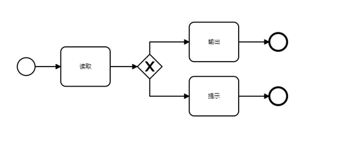 

在模型编辑和显示区域可以完成模型元素的拖动、删除操作。
用鼠标点击任意元素后进行拖动，可以移动该元素的位置。
连线元素可以移动其任意部分的位置（以转折点为分隔）。连线移动的时候，自动保持其起点和终点的位置不变。
点击拖动图标元素，可以移动其位置，同时其上的连接线自动跟随元素移动，保持连接。
鼠标点击选中任意元素后，元素会显示为选中状态，支持复制、粘贴、删除操作。
鼠标双击任意元素后，可以输入该元素名称。
模型编辑支持撤销（ctrl+z）操作和重做（ctrl+y）操作。
####快捷工具栏
鼠标选中任意元素后，元素右侧会出现针对该元素的快捷工具栏。每种元素的快捷工具栏内容有所不同。
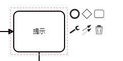 

	开始元素的快捷工具栏包括：添加结束、添加网关、添加任务、修改类型、连线、移除 这几个工具。
	结束元素的快捷工具栏包括：修改类型、连线、移除 这几个工具。
	任务元素的快捷工具栏包括：添加结束、添加网关、添加任务、修改类型、连线、移除 这几个工具。
	网关元素的快捷工具栏包括：添加结束、添加网关、添加任务、连线、移除 这几个工具。
	连线元素的快捷工具栏包括：移除 工具。
###模型设置
模型设置区域在模型编辑界面的下方。
模型设置区域包括“设置”、“参数”，“生成”三个部分，三个部分可以切换显示。“设置”区域可以完成任务设置和连线设置以及模型有效性检查；“参数”区域可以完成参数设置；“生成”区域可以完成测试用例的生成。下面几节将逐一介绍这些功能。
模型设置区域左上角有“展开”和“折叠”按钮，可以将模型设置区域展开或者折叠；还有操作提示按钮，可以打开操作提示窗口。
####设置
一、任务设置
任务设置界面。
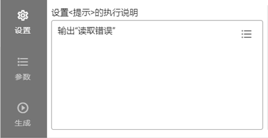 

用鼠标选中任意任务时，设置区域的左侧显示任务设置输入框。输入框可以输入任务描述信息。
输入框右上角有参数选择按钮，点击按钮可以显示参数列表。选择任意参数，可以将参数名加花括号{}插入描述信息中。

二、连线设置
连线设置界面。
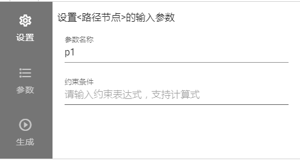 

用鼠标选中任意连线时，设置区域的左侧显示连线设置界面，包括了参数设置和约束条件设置。
参数设置中可以输入多个参数名称，用半角逗号分隔，完成对参数的添加。
约束条件可以输入由参数组成的表达式，为该连线上的约束条件。

三、模型有效性检查
区域的右侧显示模型有效性检查结果。如果检查通过，显示绿色的“模型检查通过”字样。如果检查不通过，显示红色的错误说明的信息。
模型有效性检查的规则为：
1）	每个模型必须有1个开始节点，1到n个结束节点；
2）	模型不能有从开始节点不可达的节点；
3）	已设置的约束条件必须为返回布尔值的表达式；
4）	设置约束条件时只能引用已设置的参数名；
5）	每个节点都必须可以到达至少1个结束节点；
6）	所有参数必须设置取值；
7）	参数取值必须为合格的json格式。
####参数
参数设置界面设置参数的取值范围。
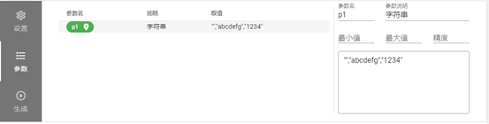 

界面左侧列出参数列表，包含了在模型中的所有连线上添加的参数。列表由参数名、说明、取值三项内容组成。设置完成的参数名称用绿色显示；未设置完成的参数名称用红色显示。（参数具有合法的取值，则认为设置完成。）
参数支持定位功能，可以定位参数在模型中首次出现的位置。
选中任意一个参数，在界面右侧显示该参数的设置界面。
设置界面包含以下元素：
1)	参数名：显示参数名，不可修改；
2)	参数说明：显示参数说明，可以修改；
3)	最小值、最大值、精度（参数为数字类型）：可以修改，设置后按等价类取值；
4)	取值（参数为json格式数据类型）：可以修改，设置后逐个取值。
####生成
进入“生成”界面，首先弹出“用例生成策略”对话框，可以输入“相邻路径深度”/“最大循环次数”和“路径组合配对数”。
1）	相邻路径深度：指的是生成的测试路径对相邻层级的路径进行组合的深度，其值不大于整个模型的层次。
注：该项在模型图不存在环路时设置
2）	最大循环次数：指的是生成的每项测试路径中任何一个节点重复出现的最大次数。
注：该项在模型图存在环路时设置
3）	路径组合配对数：指的是参数进行组合配对的阶数，其值不大于所有参数的个数。
用例生成策略输入完毕，点击“确定”按钮，软件开始生成用例，并且在“生成”界面显示生成的用例列表。
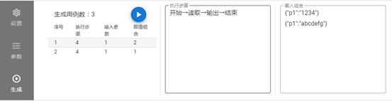 

用例列表中包含的信息有：序号、执行步骤、输入参数、取值组合。点击任意名称，可以使用该值进行排序。
鼠标选中列表中的任意用例，右侧显示该用例的详细信息。详细信息包括了“执行步骤”和“输入组合”两个部分，分别显示该用例的执行步骤和输入参数值组合。
在生成界面用例列表的右上角，有“执行”按钮，可以生成用例执行代码框架。点击该按钮，可以在弹出界面中选择生成的执行代码类型。勾选一种或多种执行代码，点击“确定”按钮，进入执行代码浏览界面，可以浏览执行代码。
###执行代码浏览	
执行代码浏览界面可以浏览所有执行代码。每种执行代码在一个独立的标签页中显示。
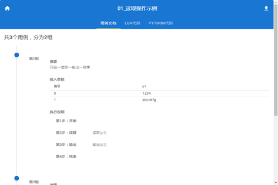 

界面左上角有“返回我的文件”按钮，可以返回我的文件。
界面右上角有“下载”按钮，可以下载生成的执行代码。
